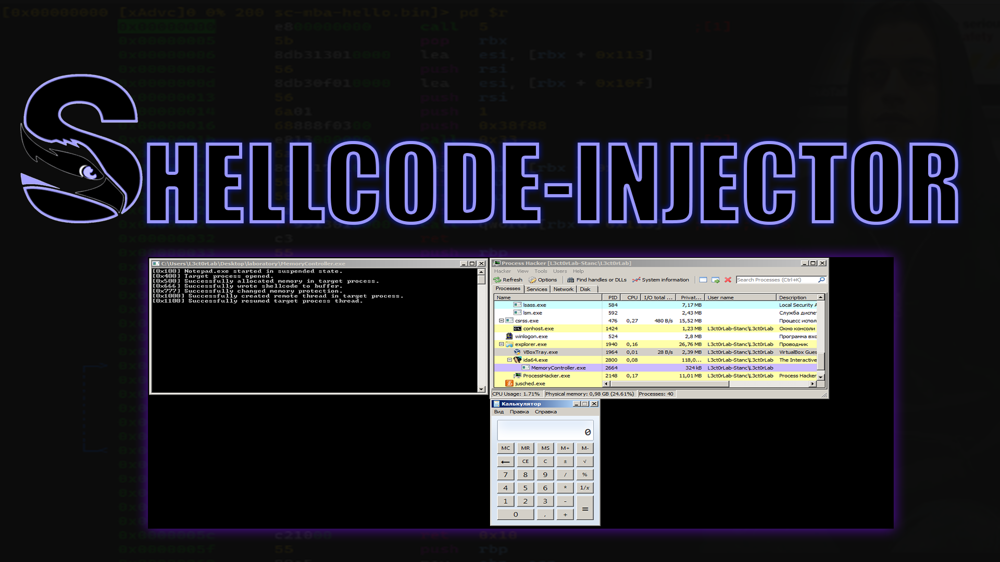
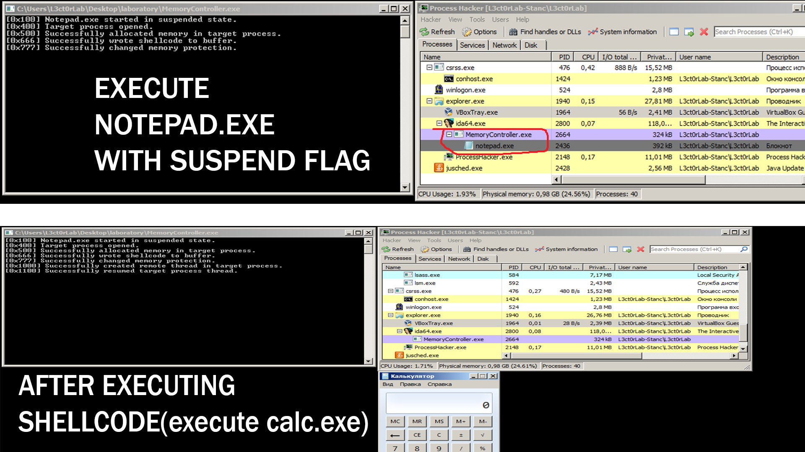

# Shellcode-Injector



## 📑 About
<b> Simple code that allows you to load shell code into an initiated-remote process.</b>

## 💻 Example
<p float="left" align="center">
  
</p> 

## ⚠️ Disclaimer
```
This project for education and purposes only!
```
